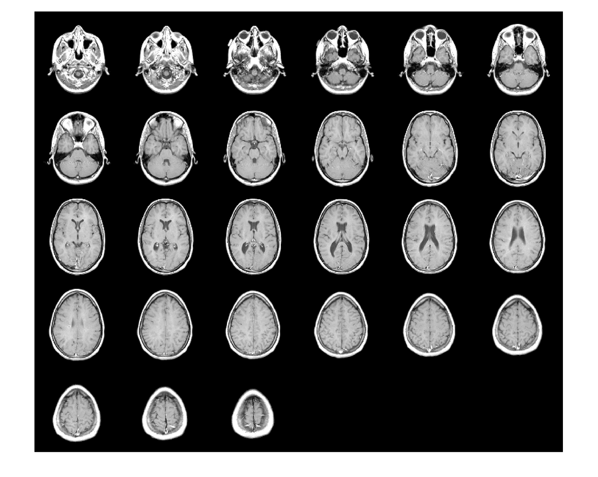
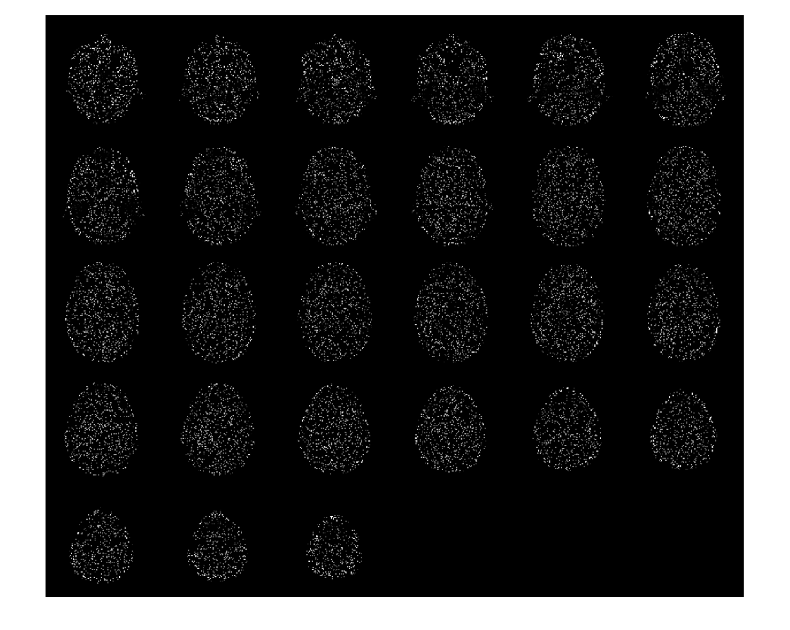
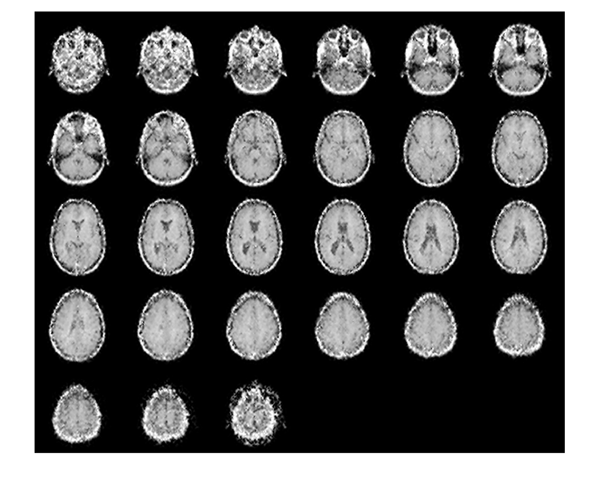

# fast MDT-Tucker

This code implements fast algorithm for low-rank tensor completion in delay embedded space.

This directory contains the MATLAB code of the proposed method (Fast-MDT-Tucker) as following:
  - data/
  - Function_Fast_MDT_Tucker/
  - demo.m
  - README.md (this file)

"data" contains the original and missing Lena images and they are compacted by the "mat" file.
"Function_Fast_MDT_Tucker" contains the function for the proposed method.
"demo.m" is a sample MATLAB code of completing 95% random voxel missing lena image.

## demo
### image

### mri

### video
