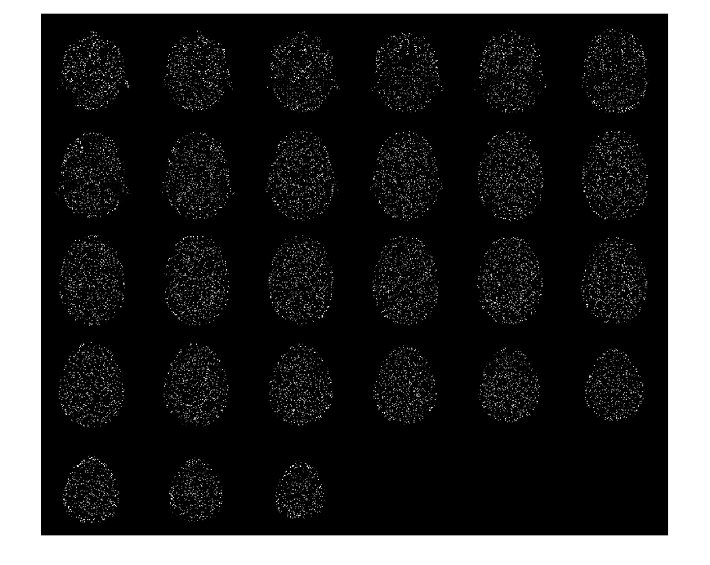

# fast MDT-Tucker

This code implements fast algorithm for low-rank tensor completion in delay embedded space.

```data/``` contains the original and missing Lena images and they are compacted by the "mat" file.
```Function_Fast_MDT_Tucker/``` contains the function for the proposed method.
completion

```demo_image.m```, ```demo_mri.m```, ```demo_video.m``` are sample MATLAB codes with fast-MDT-Tucker.


## Demo results
demo program results
### image
This result can be obtained by demo_image.m
90% missing airplane image


95% missing airplane image


### mri
original 


missing(90%)


recovered


### video
